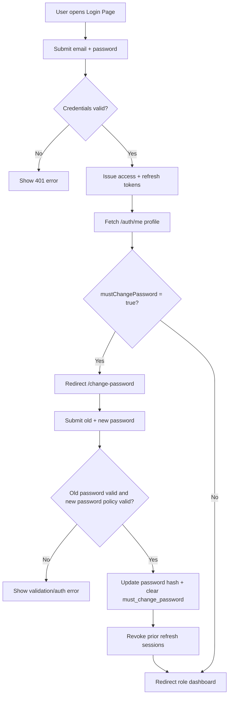
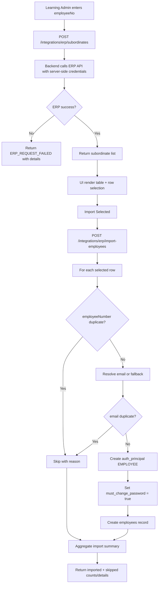
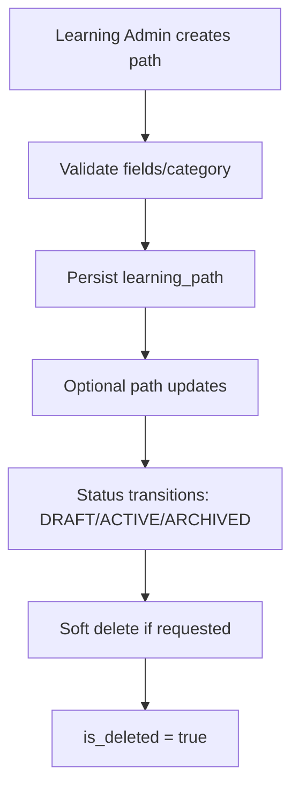
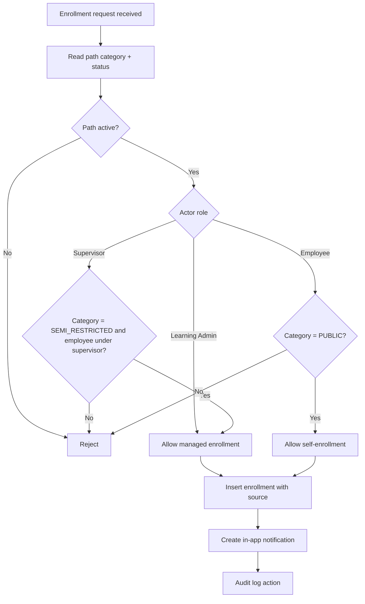
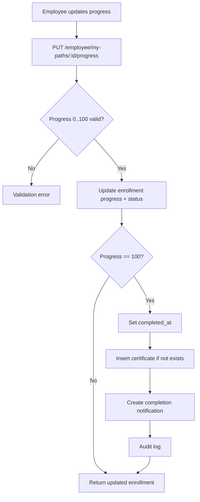
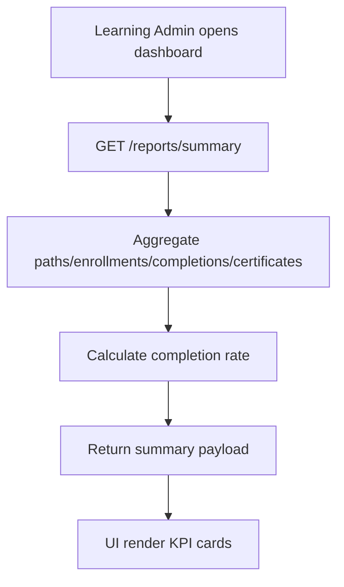
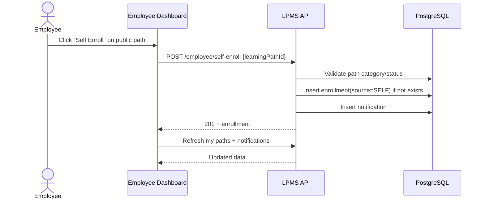

# Process Flow Diagrams / Workflow Diagrams

## Document Control
- Project: LPMS
- Artifact: Process Flows and Workflows
- Version: 1.0
- Date: 2026-02-23

## 1. Login and Forced Password Change Flow


## 2. ERP Lookup and Selective Import Flow


## 3. Learning Path Lifecycle Flow


## 4. Enrollment Governance Flow by Category


## 5. Supervisor Approval Workflow
```mermaid
flowchart TD
  A[Supervisor opens approvals] --> B[GET /supervisor/approvals]
  B --> C[List approvals scoped to supervised employees]
  C --> D[Supervisor clicks Approve/Reject]
  D --> E[POST /supervisor/approvals/:id/approve|reject]
  E --> F{Enrollment belongs to supervisor scope?}
  F -- No --> G[Return NOT_FOUND/FORBIDDEN]
  F -- Yes --> H[Update approval_status + timestamp + approver]
  H --> I[Audit log]
  I --> J[Refresh approvals list]
```

## 6. Employee Progress and Certificate Workflow


## 7. Reporting Workflow


## 8. End-to-End Public Path Self-Enrollment Journey


## 9. Operational Notes
1. All diagrams assume bearer token and RBAC checks are applied at protected endpoints.
2. Error payloads follow standardized format:
   - `{ "error": { "code": "...", "message": "...", "details": ... } }`
3. ERP integration is server-side only to protect upstream credentials.
