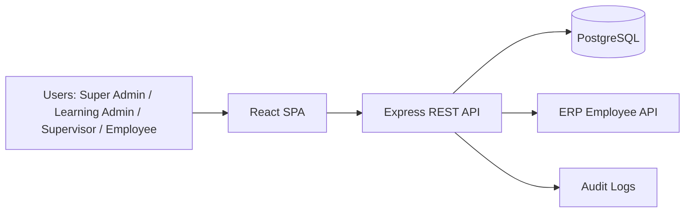
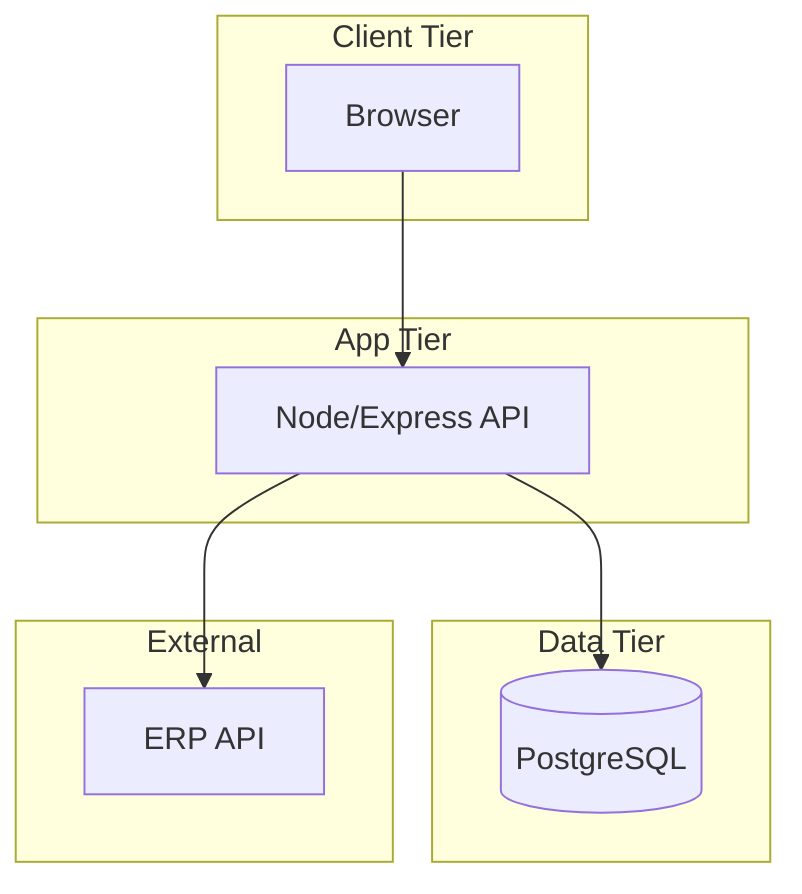

# High-Level Design (HLD)

## Document Control
- Project: Learning Path Management System (LPMS)
- Document Type: High-Level Design (HLD)
- Version: 1.0
- Date: 2026-02-23
- Status: Baseline

## 1. Objective
Define the overall LPMS system architecture, major components, integrations, security boundaries, and deployment topology.

## 2. System Context
LPMS is a web application composed of:
1. React frontend for all user roles.
2. Node.js + Express backend exposing REST APIs under `/api`.
3. PostgreSQL as system of record.
4. External ERP API used for subordinate discovery/import.

## 3. High-Level Architecture

## 4. Major Components
### 4.1 Frontend (React)
- Auth screens: login, forced password change.
- Role-based route guards and layout.
- Dashboards and modules per role.
- API service layer with bearer token propagation.

### 4.2 Backend (Node + Express)
- Auth module: login, refresh, logout, me, password change.
- RBAC middleware using canonical role enum.
- Domain modules:
  - Super Admin (users/employees, ERP import trigger)
  - Learning Admin (learning paths, enrollments)
  - Supervisor (team visibility, approvals, scoped enrollments)
  - Employee (my paths, progress, notifications, self-enroll)
- Reporting module for summary metrics.
- Integration module for ERP proxy/normalization.

### 4.3 Database (PostgreSQL)
- Core identity, learning, enrollment, progress, notification, certificate, audit tables.
- SQL migration-driven schema evolution.
- Seed data for bootstrap environments.

## 5. Security Model
1. JWT access tokens (short-lived, default 15m).
2. Refresh tokens (long-lived, default 7d), hashed at rest.
3. Passwords hashed with bcrypt.
4. Canonical RBAC roles:
   - `SUPER_ADMIN`
   - `LEARNING_ADMIN`
   - `SUPERVISOR`
   - `EMPLOYEE`
5. `must_change_password` enforced for imported employees.

## 6. Integration Model (ERP)
1. Backend-only outbound call to ERP endpoint.
2. Credentials and endpoint managed via environment variables.
3. Normalization layer maps ERP payload to LPMS employee import shape.
4. Partial import behavior: valid records imported, failures returned with reasons.

## 7. Deployment View

## 8. Non-Functional Considerations
1. Availability: graceful API error handling and validation-first controllers.
2. Performance: indexed lookups for auth, enrollments, and reporting.
3. Security: sanitized responses; no password/token hash exposure.
4. Maintainability: modular routes/controllers/services + migration history.
5. Auditability: privileged actions logged in `audit_logs`.

## 9. High-Level Risks
1. ERP data gaps (missing email/name) requiring fallback logic.
2. Growth of enrollment/reporting queries requiring future optimization.
3. Policy alignment needed for retention and compliance configuration.
